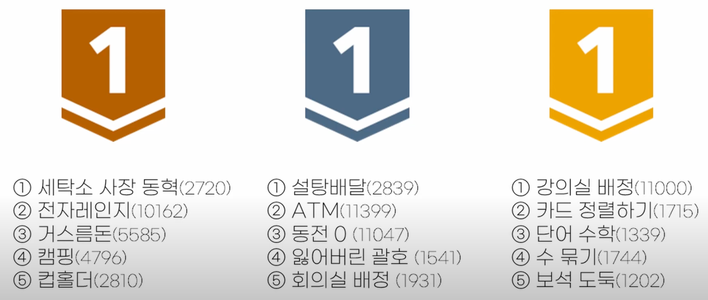

# 그리디란?

- 미래를 고려하지 않고 지금, 현재 최선의 선택을 채택하는 알고리즘
- 각 단계에서 최적이라고 생각되는 것을 선택해 나가는 방식으로 진행하여 최종적인 해답에 도달하는 알고리즘
- 항상 최적의 값을 보장하는것이 아니라 최적의 값의 ‘근사한 값’을 목표

## 그리디 알고리즘을 사용하기 위해 필요한 조건

1. 탐욕스러운 선택 조건

- 탐욕적인 선택은 항상 안전하다는 것이 보장되어야 합니다.
- 현재의 선택이 미래의 선택에 영향을 주지 않는다.
- -> 전체 문제의 최적해를 반드시 도출할 수 있어하는 문제에 적용

2. 최적 부분 구조 조건

- 문제에 대한 최종 해결 방법이 부분 문제에 대해서도 또한 최적의 해결 방법이다.
- -> 말은 전체 문제의 안에는 여러 단계가 존재하고, 이 여러 단계 내의 하나 하나의 단계에 대해 최적해가 도출되는 문제에 적용

## 그리디 알고리즘의 단계

1. 문제의 최적해 구조를 결정합니다.

2. 문제의 구조에 맞게 선택 절차를 정의합니다 : 선택 절차(Selection Procedure)

3. 선택 절차에 따라 선택을 수행합니다.

4. 선택된 해가 문제의 조건을 만족하는지 검사합니다 : 적절성 검사(Feasibility Check)

5. 조건을 만족하지 않으면 해당 해를 제외합니다.

6. 모든 선택이 완료되면 해답을 검사합니다 : 해답 검사(Solution Check)

7. 조건을 만족하지 않으면 해답으로 인정되지 않습니다.

## 그리디를 써야하는 상황

### 왜 쓸까?

- 속도가 DP보다 빠름

  - 알고리즘 : 최적화가 보장되는 경우에만 그리디를 사용해 빠르게 정답 도출하기 위해 사용
  - 실생활 : 근사치정도만 나와도 만족스러운 경우 성능 개선 위해 사용

- 예시
  - 결정 트리 학습(Decision Tree Learning)
  - 활동 선택 문제(Activity selection problem)
  - 거스름돈 문제
  - 최소 신장 트리(Minimum spanning tree)
  - 제약조건이 많은 대부분의 문제
  - 다익스트라 알고리즘
  - 허프만 코드
  - 크루스칼 알고리즘
    
